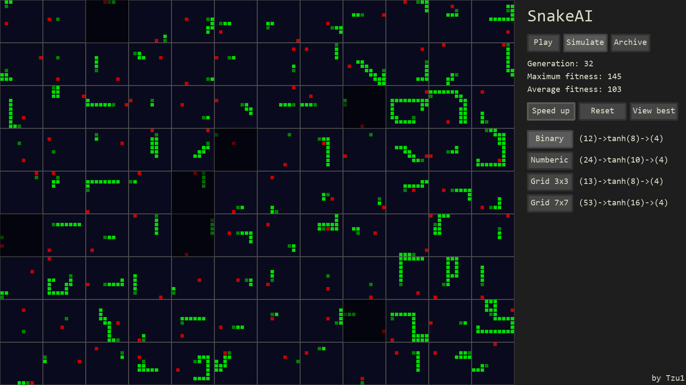
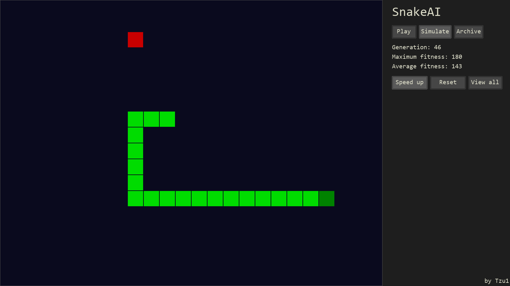
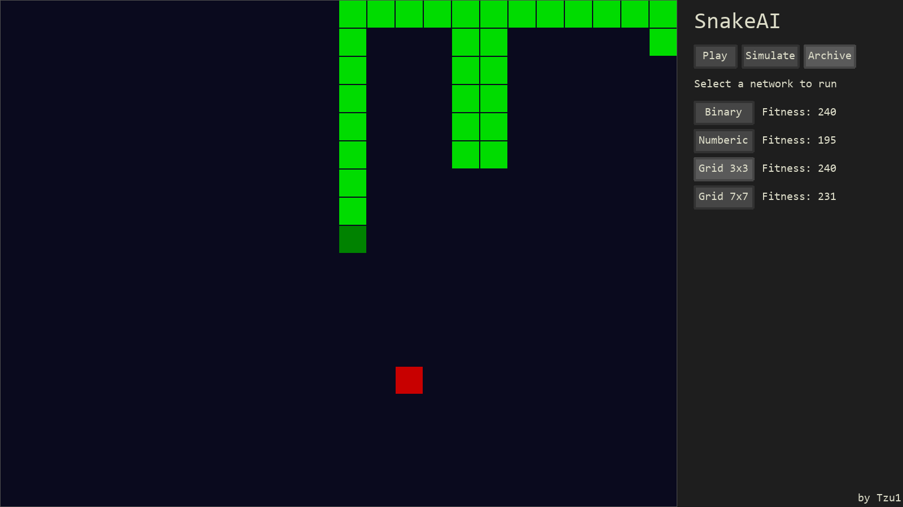

# SnakeAI

Classic snake game but with build in AI to play automatically

## About

This program trains neural networks to play Snake using the genetic algorithm method

## Simulation

Simulation in action

The best performing model is available to view

## Archive

An archive of all the best training results is available so the best models can be viwed on command

## Credits

Font by [tsenart](https://github.com/tsenart/sight/tree/master/fonts) on Github.
